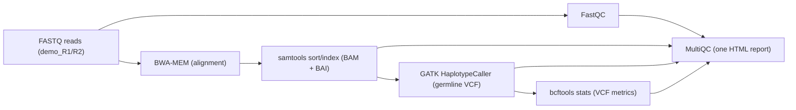

<div align="center">

# Portable Precision – GIAB Parity 🔬  
### GIAB-inspired Nextflow DSL2 germline pipeline for reproducible, portable genomics (laptop → S3 → AWS Batch)

[](https://www.nextflow.io/)
[](https://github.com/PeterHDS/peterolu-giab-parity-nextflow/actions/workflows/ci.yml)
[](https://github.com/PeterHDS)

</div>


[](https://www.nextflow.io/)
[](https://github.com/PeterHDS/peterolu-giab-parity-nextflow/actions/workflows/ci.yml)
[](https://github.com/PeterHDS)

</div>

Hi, This is **Peter Oluwatimilehin** (“Peter Olu DS” online) 👋

This repo is my flagship personal project as I move from:

* a **Microbiology** background,
* practical experience managing **electronic health record (EHR) Systems** at a international recongnized university clinic, and
* an online **cancer genomics scholarship**,

into a career in **health data science / bioinformatics** where genomics, health data and infrastructure meet.

I wanted a project that feels like the work I want to do next:

* real **FASTQ → BAM → VCF → metrics** steps,
* a **reproducible workflow** instead of loose shell commands, and
* enough **cloud / CI plumbing** to show how I think about running pipelines in real environments.

This repo is that project.

---

## 1. What this project is

**Portable Precision – GIAB Parity** is a **GIAB-style germline variant-calling pipeline** written in **Nextflow DSL2**.

It:

* starts from paired-end **FASTQ** reads and a small reference genome,
* runs through **alignment, post-processing, variant calling and stats**, and
* produces outputs that can be compared to a **GIAB-like truth set** and confident region.

It is optimised to:

* run comfortably on a **laptop / WSL2**,
* use a **tiny demo dataset** that still exercises realistic tools, and
* demonstrate how I design, organise and debug a genomics workflow.

### At a glance

* ✅ **Workflow**: FASTQ → FastQC → BWA → samtools → GATK HaplotypeCaller → bcftools → MultiQC
* ✅ **Tech**: Nextflow DSL2, conda, Linux / WSL2, small GIAB-style assets
* ✅ **Environments**: local laptop runs, S3-backed runs, AWS Batch (EC2 / Fargate experiments)
* ✅ **Evidence**: MultiQC HTML, samtools & bcftools stats, Nextflow reports in `evidence/`
* ✅ **Focus**: reproducible workflow design, health data thinking, cloud awareness

If you care about how raw reads become interpretable variants – and how that pipeline fits into real infrastructure – this repo shows how I approach that end-to-end.

---

## 2. Why I built this

My path into health data is layered:

* **Microbiology** gave me the biology and disease context.
* **EHR digitisation** at UHS Jaja Clinic showed me how data quality affects care in real time.
* A **cancer genomics scholarship** introduced me to nsSNPs, functional impact, GIAB-style benchmarking and tools like hap.py.
* My **MSc in Data Science** is giving me the statistics, modelling and governance side.

I wanted one concrete project that sits where all of that overlaps:

* serious enough for **health data / genomics teams** to recognise the pattern,
* small enough to run and inspect on a reviewer’s laptop,
* honest enough to show **what I did, what I learned, and where I’d take it next**.

---

## 3. How my journey shaped the pipeline

### 3.1. From paper records to structured data

At **Jaja Clinic** (University of Ibadan), I helped move thousands of paper records into an EHR and trained clinicians and records staff to use it. That experience shaped how I think about:

* **inputs**: clear file naming, explicit references and truth sets,
* **QC**: checking quality at multiple points instead of trusting that “it ran”,
* **traceability**: being able to answer “what happened here?” from logs and reports.

### 3.2. Cancer genomics and benchmarking

In the **cancer genomics scholarship**, I spent time on:

* how **non-synonymous SNPs** can impact protein function,
* why variant interpretation depends on **benchmarked pipelines**, and
* how truth sets like **GIAB** help us measure accuracy properly.

That’s why this project aims at a **GIAB-style design**: a clean path from reads to variants plus the ability to compare against a curated truth set and confident regions.

### 3.3. MSc Data Science and infrastructure thinking

My MSc work is pushing me to:

* design analyses with explicit assumptions,
* reason about **uncertainty and bias**, and
* think about how pipelines live inside **trusted research environments and governed platforms**.

This pipeline is where I practise that mindset in a hands-on way.

---

## 4. What the pipeline does (current scope)

The current workflow covers:

1. **Inputs**

   * Paired-end FASTQ reads (e.g. `demo_R1.fastq.gz`, `demo_R2.fastq.gz`)
   * Small reference genome (`miniref.fa`)
   * Optional GIAB-style truth VCF & confident region BED

2. **QC & alignment**

   * `FastQC` on raw reads
   * `BWA-MEM` alignment to the reference

3. **Post-processing**

   * `samtools sort` to create sorted BAMs
   * `samtools index` to create BAM indices
   * `samtools flagstat` and `samtools stats` for alignment-level metrics

4. **Variant calling & VCF stats**

   * `GATK HaplotypeCaller` for germline variant calls
   * `bcftools stats` for detailed VCF metrics

5. **Aggregated reporting**

   * `MultiQC` to assemble FastQC, samtools and bcftools outputs into a single HTML dashboard

### Pipeline overview (demo dataset)



---

## 5. What I’ve learned from building this

Some practical lessons that came directly from this project:

* **Thinking in pipelines, not commands**
  Nextflow DSL2 forced me to think in terms of **channels, dependencies and stages**, not ad-hoc scripts. That spills over into how I now approach other data workflows.

* **Designing modules that are reusable and predictable**
  Reference-building steps (indexes, dictionaries) must be **idempotent** and clearly named so they can be reused across runs without confusion.

* **Treating cloud as part of the design, not an afterthought**
  Running on **S3 + AWS Batch (EC2 and Fargate)** made me pay attention to paths, permissions and container expectations in a way that local-only pipelines never do.

* **Keeping evidence, not just logs**
  Having an `evidence/` folder with real MultiQC reports, stats files and traces means I can show, not just tell, what the pipeline actually did.

---

## 6. What specific challenges did you encounter while developing the pipeline, and how did you address them?

### 6.1. Indexing errors on BAM files

**Challenge**
`samtools index` failed with messages about the BAM format not being indexable.

**What I did**

* Traced the dataflow and realised the index step was sometimes pointed at the wrong file.
* Tightened the module boundaries so each step has a **single clear input and output** (`.sam` → sorted `.bam` → `.bam.bai`).
* Re-ran the tiny dataset until indexing was reproducible.

**What it demonstrates**
I can debug **pipeline-level issues** by following the data, not just retrying commands.

---

### 6.2. A/B lanes and channel behaviour in Nextflow

**Challenge**
The pipeline uses an A/B structure (e.g. `_A` and `_B` processes) to represent parallel “lanes” or experimental paths. Nextflow’s **single-consumer channels** made naïve re-use of channels break silently.

**What I did**

* Explicitly duplicated or split channels where both branches needed the same inputs.
* Aliased modules (`GATK_HC_A`, `GATK_HC_B`, `REF_DICT_A`, `REF_DICT_B`) so it’s obvious which branch each step belongs to.

**What it demonstrates**
An understanding of **Nextflow’s dataflow model** and how to design for clarity when the same tools are reused in different branches.

---

### 6.3. Running on AWS Batch and Fargate

**Challenge**
Taking the pipeline into **AWS Batch (EC2 / Fargate)** surfaced:

* S3 path configuration issues,
* container working directory assumptions, and
* IAM permission problems.

**What I did**

* Iterated on `nextflow.config` profiles for S3 workDirs and Batch executors.
* Used Nextflow’s **AWS debug logs, reports and timelines** to trace failures.
* Captured representative traces and reports as part of the project’s evidence, instead of hiding them.

**What it demonstrates**
I can move beyond local toy runs and start reasoning about **pipelines as cloud workloads**: storage, execution environment and observability.

---

## 7. How do you plan to further develop or expand this project in the future?

Going forward, I see three main directions:

1. **Teaching & onboarding use-case**
   Turn this into a small, opinionated pipeline that new health data scientists can use to learn the basics of variant calling, QC and cloud-aware workflow design.

2. **Stronger AWS story**
   Take the lessons from `v0.3-fargate-core-ok` and shape them into a documented profile that:

   * runs end-to-end on AWS Batch with S3 workDirs, and
   * ships with a short “how to run this in the cloud” guide and carefully chosen limits.

3. **Deeper benchmarking & downstream analysis**

   * Re-introduce a clean **hap.py** step on a public GIAB subset.
   * Add a small R / Python notebook that interprets the metrics (precision, recall, F1, stratifications) for non-bioinformatics stakeholders.

---

## 8. What metrics or criteria do you use to evaluate the performance and accuracy of your variant-calling workflow?

Even at this scale, I care about **how** the pipeline performs, not just whether it finishes.

1. **Read-level quality**

   * FastQC summaries (per-base quality, adapter content, over-represented sequences).

2. **Alignment quality**

   * `samtools flagstat` and `samtools stats`: mapping rate, properly paired reads, duplicates, error profiles.

3. **Variant-level properties**

   * `bcftools stats`: counts by variant type, Ti/Tv ratio, depth distributions and basic sanity checks on the VCF.

4. **Pipeline behaviour**

   * Consistency of outputs across runs on the same tiny dataset.
   * Nextflow reports, timelines and traces for insight into resource use and stage timings.

5. **Truth-set benchmarking (roadmap)**

   * Using **GIAB-style truth data + hap.py** to measure precision, recall and F-scores inside confident regions and across variant strata.

These are the same kinds of questions I would expect to ask if I were working on larger pipelines in a research group or health data team.

---

## 9. Quick start – tiny local run

This demo is intentionally small so you can run it on a typical laptop.

### Requirements

* Linux / WSL2 or macOS
* `conda` / `mamba`
* Java 17+
* Nextflow (∼ v25.x)

### Setup

```bash
# clone
git clone git@github.com:PeterHDS/peterolu-giab-parity-nextflow.git
cd peterolu-giab-parity-nextflow

# create environment
conda create -n giab-nf -y \
  -c conda-forge -c bioconda \
  nextflow \
  bwa \
  samtools \
  fastqc \
  gatk4 \
  bcftools \
  multiqc

conda activate giab-nf
```

### Run the tiny demo

From the `pipeline/` folder:

```bash
cd pipeline

nextflow run main.nf \
  --outdir ./results/local-run-clean
```

After the run:

```bash
ls results/local-run-clean
# align/ bam/ fastqc/ metrics/ multiqc/ ref/ vcf_stats/
```

Open:

* `results/local-run-clean/multiqc/multiqc_report.html`

to see the combined QC and stats dashboard.

---

## 10. Cloud & portability (AWS / S3 / Batch)

I used this repo to practise moving beyond local runs:

* configuring **S3** as the Nextflow `workDir` and `outdir`,
* setting up **AWS Batch** queues and compute environments (EC2 and Fargate), and
* reading **AWS debug logs, timelines and traces** when jobs failed.

The branch:

* `v0.3-fargate-core-ok`

captures the core pipeline wired for Batch and S3 and reflects the experiments I’ve already done in that space.

The point is to show that:

* I have started doing the actual work of running pipelines in the cloud,
* I understand the types of issues that show up there, and
* I keep the **configuration and evidence** alongside the code.

---

## 11. Branches at a glance

* **`main`**

  * Clean tiny local run.
  * `evidence/` with MultiQC + stats snapshots.
  * Minimal CI that runs a Nextflow sanity check stub-run.

* **`v0.3-fargate-core-ok`**

  * AWS Batch / Fargate-focused branch.
  * Same core pipeline, with cloud-oriented config and evidence.

---

## 12. Evidence

The `evidence/` folder is there so you can **see the outputs** without having to run everything yourself.

Examples:

* `evidence/local/multiqc_report.html`
  – MultiQC report from a clean local demo run.

* `evidence/local/demo_R.samtools_flagstat.txt`

* `evidence/local/demo_R.samtools_stats.txt`

* `evidence/local/demo_R.bcftools.stats.txt`
  – alignment and VCF metrics for the demo dataset.

As I strengthen the cloud and benchmarking story, this folder is where I’ll add:

* selected **Nextflow reports, timelines and traces**, and
* **hap.py summary CSVs** from GIAB-style evaluations.

---

## 13. About this project & about me

This project is how I show my thinking to teams who work at the intersection of:

* genomics,
* health data, and
* infrastructure.

It pulls together:

* my **Microbiology** training,
* my experience **running and improving an EHR** in a real clinic,
* my **cancer genomics** reading and scholarship, and
* my **MSc Data Science** focus on statistics and responsible use of data.

I’m **Peter Oluwatimilehin**.
I’m interested in roles where pipelines, data products and governance come together – for example:

* building and maintaining **reproducible workflows** in trusted environments,
* benchmarking and improving **variant-calling pipelines**, or
* designing **health data tools** that clinicians and researchers can trust.

If you’re reviewing this as a mentor, partner organisation or potential employer, this repo is a small but concrete example of how I approach that work.

---

## 14. References & influences

Some of the tools and ideas that shaped this project:

* **Nextflow** – workflow engine and DSL2 structure
* **Genome in a Bottle (GIAB)** – truth sets and confident regions
* **GATK** – variant calling practices
* **MultiQC** – turning scattered QC outputs into one narrative view

If you recognise your tool, paper or idea here: thank you for making it available.
